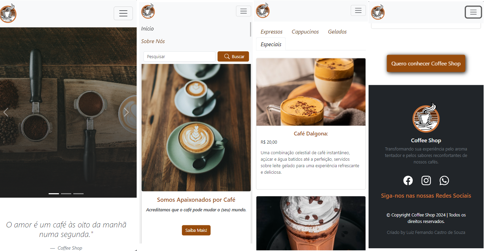

# Site cafeteria CSS3-DIO

### Iniciando com Primeiro Framework em CSS: Bootstrap💜

Desafio realizado no Módulo 3 do curso CSS3 da DIO, O projeto consiste na criação de um site de uma cafeteria (fictícia), utilizando o **Bootstrap** para estilizar a página com os principais componentes disponíveis e deixa-la responsiva. O usuário poderá visualizar os produtos disponíveis no ***Menu***, ***Local da cafeteria*** ,além de outras informações da loja. 

## Tecnologias e Frameworks
* 🟠 HTML: Utilizado para criar a estrutura básica das páginas web.

* 🔵 CSS: Usado para estilizar alguns componentes e torná-los visualmente atraentes.

* 🟣 Bootstrap: Um framework front-end popular, usado para criar layouts responsivos e componentes de interface de usuário consistentes.
[Bootstrap](https://getbootstrap.com/)

## Estruta do Projeto

```
Tree
Projeto Site Coffee Shop/
├── assets
│   ├── icons
│   │   ├── facebook.svg
│   │   ├── instagram.svg
│   │   ├── search.svg
│   │   └── ...
│   ├── images
│   │   ├── coffe.png
│   │   └── ...
│   └── css
│       └── styles.css
│ 
├── index.html
├── README.md
```

## Conclusão sobre o Desafio (Bootstrap)🚀

O Bootstrap provou ser uma ferramenta valiosa para o desenvolvimento de projetos web. Sua vasta biblioteca de componentes pré-construídos e sua abordagem centrada em grade facilitam a criação de layouts responsivos e agradáveis visualmente. Além disso, sua documentação abrangente e ativa comunidade de desenvolvedores tornam mais fácil aprender e aproveitar ao máximo o framework.

Desafio concluído com uma breve experiência de como é utilizar o Bootstrap, aprendizado foi fundamental porém ótimo pois pode agregar mais conteúdos ao meu aprendizado e na minha jornada como DFE.

## link do Projeto Final 🎯
☕🥐[Site Coffee Shop](http://cafe-da-manha.netl)🥐☕

### Imagem deskstop


### Imagem mobile
